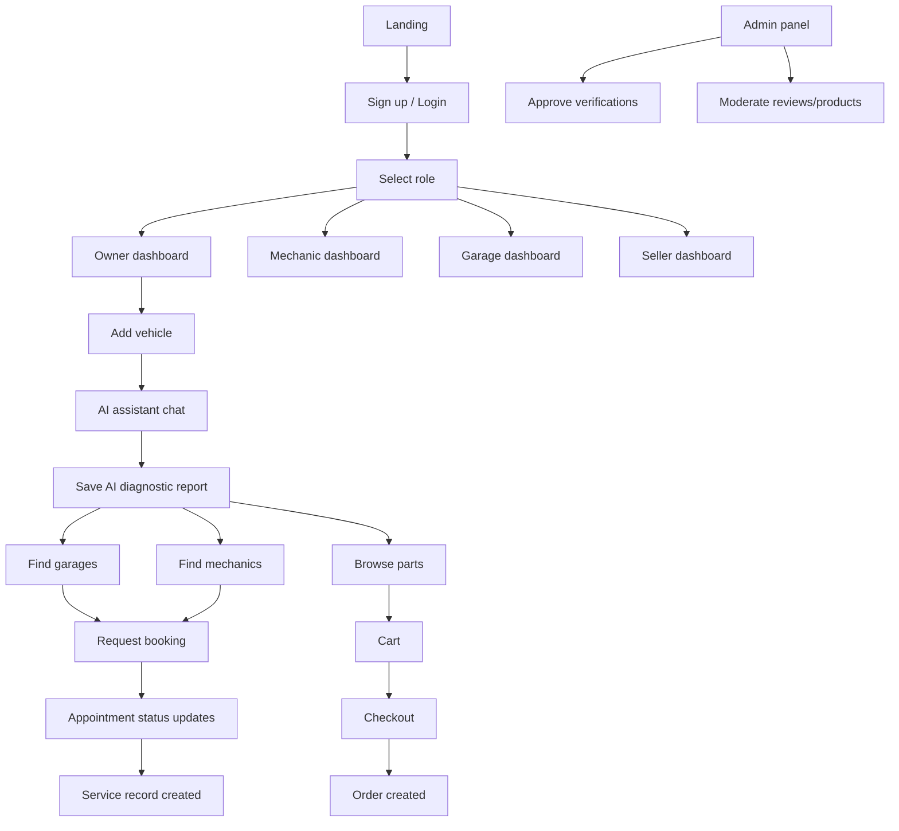

## 1. Product Overview
MechanicAI is a premium automotive web platform connecting car owners, mechanics, garages, and spare-parts sellers with an AI-powered diagnostic assistant.
- Solves: fragmented repair discovery, unclear diagnoses, unreliable service history, and hard-to-source parts
- Targets: car owners (primary), independent mechanics/garages, spare parts sellers, and platform admins

## 2. Core Features

### 2.1 User Roles
| Role | Registration Method | Core Permissions |
|------|---------------------|------------------|
| Car Owner | Email + Google | Manage vehicles, use AI assistant, book services, buy parts, reviews |
| Mechanic | Email + Google + verification | Profile, bookings, service records, chat with clients, analytics |
| Garage Manager | Email + Google + verification | Garage profile, staff management, appointments, reviews, revenue analytics |
| Parts Seller | Email + Google + verification | Catalog, inventory, orders, fulfillment |
| Admin | Internal assignment | Full moderation, analytics, reports, settings |

### 2.2 Feature Modules
1. **Home**: hero, animated 3D car showcase, AI CTA, stats, services, testimonials, FAQ, contact
2. **AI Mechanic Assistant**: multi-turn chat, symptom intake, guided questions, diagnosis, repair/maintenance suggestions, multilingual, saved history, export report
3. **Garage Directory**: search, city filter, map, ratings/reviews, garage profile, contact, booking entry points
4. **Mechanic Marketplace**: mechanic profiles, skills/certifications, availability, booking and payments-ready flow (capture intent + status)
5. **Spare Parts Marketplace**: catalog, categories, search, product page, cart, checkout (order creation), order management
6. **Owner Dashboard**: profile, vehicles, service history, AI reports, bookings, orders, notifications
7. **Mechanic Dashboard**: client list, appointment management, service records, revenue analytics, notifications
8. **Garage Dashboard**: appointments, staff, service records, reviews, analytics
9. **Seller Dashboard**: products, inventory, orders, fulfillment status, analytics
10. **Admin Panel**: users/garages/mechanics/products moderation, analytics dashboard, reports export
11. **Vehicle Management**: add vehicles, VIN support, maintenance tracking, reminders, repair history
12. **Authentication & RBAC**: email/password, Google, role-based routing, row-level security

### 2.3 Page Details
| Page Name | Module Name | Feature description |
|-----------|-------------|---------------------|
| Home | Hero | Matte-black cinematic hero, 3D car highlight, primary CTA to AI assistant |
| Home | Services | 4–6 cards: diagnostics, booking, parts, records, reminders, marketplace |
| Home | Testimonials | Rotating carousel, credibility badges, ratings summary |
| Home | FAQ | Accordion, SEO-friendly markup |
| Home | Contact | Form + garage onboarding CTA |
| AI Assistant | Chat | Streaming responses, guided prompts, language selector, attachments-ready |
| AI Assistant | Reports | Save a diagnostic report, link to vehicle and service record |
| Garages | Search & Filters | City, open-now, rating, services, verified badge |
| Garages | Map | Visual exploration with pins; fallback list-only on low-power devices |
| Garage Profile | Overview | Photos, services, hours, address, contact, rating breakdown |
| Garage Profile | Reviews | Write review (owner-only after booking), moderation |
| Mechanics | Directory | Filters: skills, experience, certifications, languages, rating |
| Mechanic Profile | Booking | Availability slots, request booking, chat entry point |
| Parts | Catalog | Categories, search, sort, pagination, fast image loading |
| Part Details | Product | Gallery, compatibility notes, stock, seller info, add-to-cart |
| Cart | Items | Quantity, remove, totals, shipping estimate |
| Checkout | Create Order | Address, contact, payment-ready placeholders, confirmation |
| Owner Dashboard | Vehicles | Add/edit vehicles, VIN decode placeholder, maintenance schedule |
| Owner Dashboard | Service History | Timeline, documents upload, invoice fields |
| Owner Dashboard | AI Reports | Browse/export reports, share with mechanic/garage |
| Owner Dashboard | Bookings | Upcoming/past, cancel/reschedule states |
| Owner Dashboard | Orders | Status tracking, reorder, invoices |
| Mechanic Dashboard | Appointments | Calendar/list, accept/decline, status updates |
| Mechanic Dashboard | Service Records | Create service record linked to vehicle + owner |
| Mechanic Dashboard | Analytics | Revenue/appointments charts, simple cohort metrics |
| Admin | Moderation | Approvals, suspensions, content flags, audit events |

## 3. Core Process
Primary flows:
1. Owner signs up → adds vehicle → uses AI assistant → saves report → books mechanic/garage or buys parts.
2. Mechanic/garage signs up → submits verification → lists services → receives booking requests → completes service → records service history.
3. Seller signs up → lists parts → receives orders → fulfills → updates status.
4. Admin reviews verifications/content → manages reports and analytics.

## 4. User Interface Design

### 4.1 Design Style
- Theme: futuristic 2026 luxury-garage atmosphere
- Background: matte black with subtle noise and gradient mesh depth
- Accents: metallic silver edges, neon green highlights, electric-blue glow layers
- Surfaces: glassmorphism cards (blur + thin border + soft shadow), premium 3D buttons
- Typography: display font with industrial-tech character + clean condensed body font; keep 4–5 sizes total
- Motion: smooth entrance choreography, hover glows, scroll-driven reveals, micro-interactions on controls
- Iconography: thin-line, automotive-inspired, consistent stroke width

### 4.2 Page Design Overview
| Page Name | Module Name | UI Elements |
|-----------|-------------|-------------|
| Home | Hero | 3D car scene or cinematic canvas, neon highlights, animated CTA button |
| AI Assistant | Chat | Floating glass panel, message bubbles with status chips, streaming indicator |
| Garages | Directory | Split layout: list + map, filter drawer on mobile, verified badge |
| Mechanics | Profiles | Skill pills, certification tags, availability strip, booking CTA |
| Parts | Catalog | High-contrast cards, quick add-to-cart, image shimmer loading |
| Dashboards | Navigation | Role-based sidebar, quick actions, notification center, analytics tiles |
| Admin | Tables | Dense but elegant tables, bulk actions, audit timeline drawer |

### 4.3 Responsiveness
- Mobile-first: sticky bottom navigation for owner flows; filter drawer; thumb-friendly spacing
- Tablet/desktop: sidebar dashboards, split list/map layouts, denser data tables with column controls
- Accessibility: visible focus rings, semantic structure, reduced-motion mode support

### 4.4 3D Scene Guidance
- Mood: luxury garage bay with soft fog, cold blue rim lights, neon green underglow accents
- Lighting: key light from above, rim lights left/right, subtle HDRI reflections (performance capped)
- Camera: slow orbit on hero, parallax on scroll, disable heavy effects on low-power devices
- Interactions: hover highlight on key car parts, subtle engine glow pulses, CTA synchronized animation beat
- Post-processing: mild bloom, vignette, chromatic aberration kept minimal; strict performance budget
