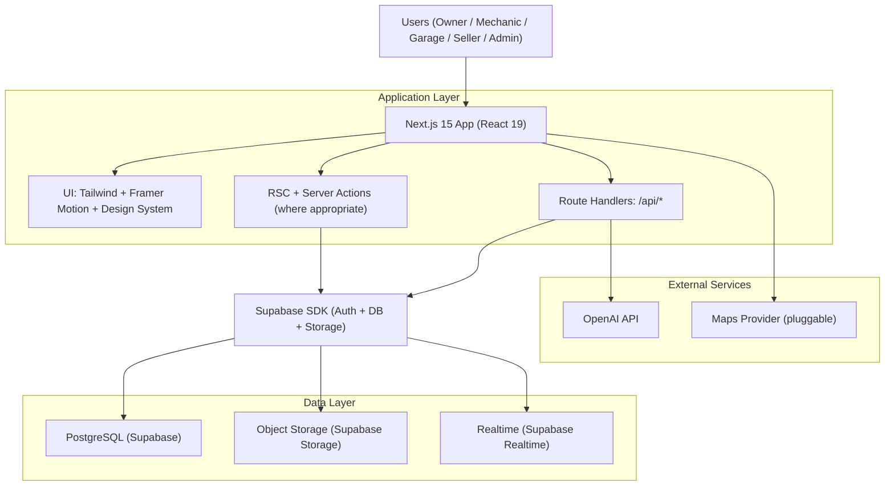
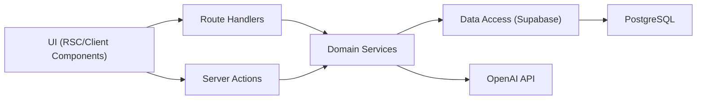
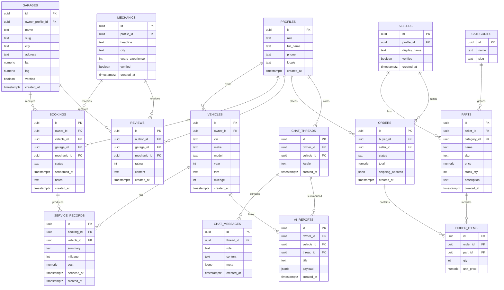

## 1. Architecture Design



## 2. Technology Description
- Frontend: Next.js 15 + React 19 + TypeScript + Tailwind CSS + Framer Motion
- UI/3D: optional @react-three/fiber + drei + postprocessing for hero car scenes (feature-flagged)
- Backend: Next.js Route Handlers + Server Actions; Supabase as primary backend platform
- Auth: Supabase Auth (email/password + Google OAuth)
- Database: PostgreSQL (Supabase), Row Level Security for RBAC
- AI: OpenAI API for diagnostics + multilingual responses (server-side calls only)
- Observability: Next.js logging + database audit tables; pluggable external monitoring

## 3. Route Definitions
| Route | Purpose |
|-------|---------|
| / | Home landing page with product narrative and CTAs |
| /assistant | AI Mechanic Assistant chat + reports |
| /garages | Garage directory: search/filter/map |
| /garages/[slug] | Garage profile + reviews + booking entry |
| /mechanics | Mechanic marketplace |
| /mechanics/[id] | Mechanic profile + booking request |
| /parts | Spare parts catalog |
| /parts/[id] | Product details |
| /cart | Shopping cart |
| /checkout | Checkout (order creation) |
| /auth/login | Login |
| /auth/register | Register |
| /dashboard | Owner dashboard (default for owners) |
| /dashboard/vehicles | Vehicle management |
| /dashboard/history | Service history |
| /dashboard/reports | AI diagnostic reports |
| /dashboard/bookings | Bookings |
| /dashboard/orders | Orders |
| /mechanic | Mechanic dashboard home |
| /mechanic/appointments | Appointment management |
| /mechanic/records | Service records |
| /mechanic/analytics | Revenue analytics |
| /garage | Garage dashboard home |
| /garage/appointments | Garage appointment management |
| /garage/staff | Staff management |
| /garage/reviews | Review insights and responses |
| /seller | Seller dashboard home |
| /seller/products | Product management |
| /seller/orders | Order fulfillment |
| /admin | Admin panel home |
| /admin/users | User management |
| /admin/garages | Garage approvals and management |
| /admin/mechanics | Mechanic approvals and management |
| /admin/products | Product moderation |
| /admin/analytics | Platform analytics |
| /admin/reports | Reports export |

## 4. API Definitions

### 4.1 Auth & Profile
- `GET /api/me`: returns current authenticated user profile and role

### 4.2 AI Assistant
- `POST /api/ai/chat`
  - Request (TypeScript):
    ```ts
    export type AiChatRequest = {
      threadId?: string
      vehicleId?: string
      locale: string
      message: string
    }
    ```
  - Response:
    ```ts
    export type AiChatResponse = {
      threadId: string
      messageId: string
      assistantMessage: string
      suggestedNextQuestions: string[]
      safetyNotes: string[]
    }
    ```
- `POST /api/ai/report`: converts a thread into a saved diagnostic report linked to a vehicle

### 4.3 Directories
- `GET /api/garages?city=&q=&services=&ratingMin=`
- `GET /api/mechanics?q=&skills=&city=&ratingMin=`

### 4.4 Booking
- `POST /api/bookings`
- `PATCH /api/bookings/[id]`: status transitions (requested/accepted/declined/completed/cancelled)

### 4.5 Marketplace
- `GET /api/parts?category=&q=&sort=&page=`
- `POST /api/cart/items`
- `POST /api/orders`
- `GET /api/orders`: scoped by role (owner sees own orders, seller sees assigned orders)

## 5. Server Architecture Diagram



## 6. Data Model

### 6.1 Data Model Definition



### 6.2 Data Definition Language

```sql
create extension if not exists "pgcrypto";

create type public.app_role as enum ('owner','mechanic','garage','seller','admin');
create type public.booking_status as enum ('requested','accepted','declined','cancelled','completed');
create type public.order_status as enum ('pending','confirmed','shipped','delivered','cancelled','refunded');

create table public.profiles (
  id uuid primary key references auth.users(id) on delete cascade,
  role public.app_role not null default 'owner',
  full_name text,
  phone text,
  locale text not null default 'en',
  created_at timestamptz not null default now()
);

create table public.vehicles (
  id uuid primary key default gen_random_uuid(),
  owner_id uuid not null references public.profiles(id) on delete cascade,
  vin text,
  make text,
  model text,
  year int,
  trim text,
  mileage int,
  created_at timestamptz not null default now()
);
create index vehicles_owner_id_idx on public.vehicles(owner_id);

create table public.garages (
  id uuid primary key default gen_random_uuid(),
  owner_profile_id uuid not null references public.profiles(id) on delete cascade,
  name text not null,
  slug text not null unique,
  city text not null,
  address text,
  lat numeric,
  lng numeric,
  verified boolean not null default false,
  created_at timestamptz not null default now()
);
create index garages_city_idx on public.garages(city);

create table public.mechanics (
  id uuid primary key default gen_random_uuid(),
  profile_id uuid not null unique references public.profiles(id) on delete cascade,
  headline text,
  city text,
  years_experience int,
  verified boolean not null default false,
  created_at timestamptz not null default now()
);
create index mechanics_city_idx on public.mechanics(city);

create table public.bookings (
  id uuid primary key default gen_random_uuid(),
  owner_id uuid not null references public.profiles(id) on delete cascade,
  vehicle_id uuid references public.vehicles(id) on delete set null,
  garage_id uuid references public.garages(id) on delete set null,
  mechanic_id uuid references public.mechanics(id) on delete set null,
  status public.booking_status not null default 'requested',
  scheduled_at timestamptz,
  notes text,
  created_at timestamptz not null default now(),
  constraint bookings_target_check check ((garage_id is not null) or (mechanic_id is not null))
);
create index bookings_owner_id_idx on public.bookings(owner_id);
create index bookings_garage_id_idx on public.bookings(garage_id);
create index bookings_mechanic_id_idx on public.bookings(mechanic_id);

create table public.service_records (
  id uuid primary key default gen_random_uuid(),
  booking_id uuid references public.bookings(id) on delete set null,
  vehicle_id uuid references public.vehicles(id) on delete set null,
  summary text not null,
  mileage int,
  cost numeric,
  serviced_at timestamptz,
  created_at timestamptz not null default now()
);
create index service_records_vehicle_id_idx on public.service_records(vehicle_id);

create table public.reviews (
  id uuid primary key default gen_random_uuid(),
  author_id uuid not null references public.profiles(id) on delete cascade,
  garage_id uuid references public.garages(id) on delete cascade,
  mechanic_id uuid references public.mechanics(id) on delete cascade,
  rating int not null check (rating between 1 and 5),
  content text,
  created_at timestamptz not null default now(),
  constraint reviews_target_check check ((garage_id is not null) or (mechanic_id is not null))
);
create index reviews_garage_id_idx on public.reviews(garage_id);
create index reviews_mechanic_id_idx on public.reviews(mechanic_id);

create table public.sellers (
  id uuid primary key default gen_random_uuid(),
  profile_id uuid not null unique references public.profiles(id) on delete cascade,
  display_name text not null,
  verified boolean not null default false,
  created_at timestamptz not null default now()
);

create table public.categories (
  id uuid primary key default gen_random_uuid(),
  name text not null,
  slug text not null unique
);

create table public.parts (
  id uuid primary key default gen_random_uuid(),
  seller_id uuid not null references public.sellers(id) on delete cascade,
  category_id uuid references public.categories(id) on delete set null,
  name text not null,
  sku text,
  price numeric not null check (price >= 0),
  stock_qty int not null default 0 check (stock_qty >= 0),
  description text,
  created_at timestamptz not null default now()
);
create index parts_seller_id_idx on public.parts(seller_id);
create index parts_category_id_idx on public.parts(category_id);

create table public.orders (
  id uuid primary key default gen_random_uuid(),
  buyer_id uuid not null references public.profiles(id) on delete cascade,
  seller_id uuid not null references public.sellers(id) on delete cascade,
  status public.order_status not null default 'pending',
  total numeric not null default 0 check (total >= 0),
  shipping_address jsonb not null default '{}'::jsonb,
  created_at timestamptz not null default now()
);
create index orders_buyer_id_idx on public.orders(buyer_id);
create index orders_seller_id_idx on public.orders(seller_id);

create table public.order_items (
  id uuid primary key default gen_random_uuid(),
  order_id uuid not null references public.orders(id) on delete cascade,
  part_id uuid not null references public.parts(id) on delete restrict,
  qty int not null check (qty > 0),
  unit_price numeric not null check (unit_price >= 0)
);
create index order_items_order_id_idx on public.order_items(order_id);

create table public.chat_threads (
  id uuid primary key default gen_random_uuid(),
  owner_id uuid not null references public.profiles(id) on delete cascade,
  vehicle_id uuid references public.vehicles(id) on delete set null,
  locale text not null default 'en',
  created_at timestamptz not null default now()
);
create index chat_threads_owner_id_idx on public.chat_threads(owner_id);

create table public.chat_messages (
  id uuid primary key default gen_random_uuid(),
  thread_id uuid not null references public.chat_threads(id) on delete cascade,
  role text not null check (role in ('user','assistant','system')),
  content text not null,
  meta jsonb not null default '{}'::jsonb,
  created_at timestamptz not null default now()
);
create index chat_messages_thread_id_idx on public.chat_messages(thread_id);

create table public.ai_reports (
  id uuid primary key default gen_random_uuid(),
  owner_id uuid not null references public.profiles(id) on delete cascade,
  vehicle_id uuid references public.vehicles(id) on delete set null,
  thread_id uuid references public.chat_threads(id) on delete set null,
  title text not null,
  payload jsonb not null default '{}'::jsonb,
  created_at timestamptz not null default now()
);
create index ai_reports_owner_id_idx on public.ai_reports(owner_id);
create index ai_reports_vehicle_id_idx on public.ai_reports(vehicle_id);

alter table public.profiles enable row level security;
alter table public.vehicles enable row level security;
alter table public.garages enable row level security;
alter table public.mechanics enable row level security;
alter table public.bookings enable row level security;
alter table public.service_records enable row level security;
alter table public.reviews enable row level security;
alter table public.sellers enable row level security;
alter table public.categories enable row level security;
alter table public.parts enable row level security;
alter table public.orders enable row level security;
alter table public.order_items enable row level security;
alter table public.chat_threads enable row level security;
alter table public.chat_messages enable row level security;
alter table public.ai_reports enable row level security;

create policy "profiles_read_own" on public.profiles
  for select using (auth.uid() = id);
create policy "profiles_update_own" on public.profiles
  for update using (auth.uid() = id);

create policy "vehicles_crud_own" on public.vehicles
  for all using (auth.uid() = owner_id) with check (auth.uid() = owner_id);

create policy "garages_read_public" on public.garages
  for select using (true);
create policy "garages_update_owner" on public.garages
  for update using (auth.uid() = owner_profile_id);

create policy "mechanics_read_public" on public.mechanics
  for select using (true);
create policy "mechanics_update_owner" on public.mechanics
  for update using (auth.uid() = profile_id);

create policy "parts_read_public" on public.parts
  for select using (true);

create policy "orders_read_buyer" on public.orders
  for select using (auth.uid() = buyer_id);

create policy "chat_threads_crud_own" on public.chat_threads
  for all using (auth.uid() = owner_id) with check (auth.uid() = owner_id);
create policy "chat_messages_crud_thread_owner" on public.chat_messages
  for all using (
    exists (
      select 1 from public.chat_threads t
      where t.id = chat_messages.thread_id
      and t.owner_id = auth.uid()
    )
  ) with check (
    exists (
      select 1 from public.chat_threads t
      where t.id = chat_messages.thread_id
      and t.owner_id = auth.uid()
    )
  );
```

Notes:
- Admin-level access is implemented by checking `profiles.role = 'admin'` in policies or via Supabase “service role” on server-side only.
- Map provider is pluggable; implementation should degrade gracefully to list-only mode when unavailable.
